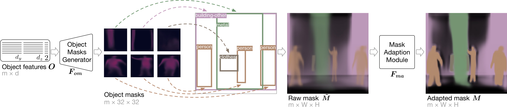

# Image Synthesis from Layout with Locality-Aware Mask Adaptation
This repository contains a PyTorch implementation of our ICCV 2021 paper [**Image Synthesis from Layout with Locality-Aware Mask Adaptation**](https://openaccess.thecvf.com/content/ICCV2021/papers/Li_Image_Synthesis_From_Layout_With_Locality-Aware_Mask_Adaption_ICCV_2021_paper.pdf).


## Abstract 
This paper is concerned with synthesizing images conditioned on a layout (a set of bounding boxes with object categories). Existing works construct a layout-mask image pipeline. Object masks are generated separately and mapped to bounding boxes to form a whole semantic segmentation mask (layout-to-mask), with which a new image is generated (mask-to-image). However, overlapped boxes in layouts result in overlapped object masks, which reduces the mask clarity and causes confusion in image generation.

We hypothesize the importance of generating clean and semantically clear semantic masks. The hypothesis is supported by the finding that the performance of state-of-the-art LostGAN decreases when input masks are tainted. Motivated by this hypothesis, we propose Locality-Aware Mask Adaption (LAMA) module to adapt overlapped or nearby object masks in the generation. Experimental results show our proposed model with LAMA outperforms existing approaches regarding visual fidelity and alignment with input layouts. On COCO-stuff in 256×256, our method improves the state-of-the-art FID score from 41.65 to 31.12 and the SceneFID from 22.00 to 18.64.

## Main Pipeline


## Main Results


## Implementation

The environment is tested on Ubuntu 16.04 with CUDA 10.01 and NVIDIA RTX 2080 TI. The code is written in PyTorch 1.6, and the requirements of conda environment are provided in LAMA.yaml, LAMA_tf.yaml and LAMA_YOLO.yaml. 


## Pretrained Models
We provide pre-trained models of COCO and VG in [Google Drive](https://drive.google.com/drive/folders/1A7nAXpE5yS1gRYpyDtxCpWKDGeKNH3RQ
) and 
[Weiyun](https://share.weiyun.com/GPs3ogjp).
Please put all pretrained models under `pretrained_models/`


## Installation

### Environment
Create an environment in conda
```
conda env create -f LAMA_tf.yaml
conda env create -f LAMA.yaml
conda activate LAMA
pip install tensorboardX pycocotools
```

### Setup for roi_layers
```
python setup.py build develop
```

## Data
Download COCO dataset to `datasets/coco`
```
bash scripts/download_coco.sh
```
Download VG dataset to `datasets/vg`
```
bash scripts/download_vg.sh
python scripts/preprocess_vg.py
```

## Training
The training process uses PyTorch DataDistributedParallel module.
```
conda activate LAMA
export CUDA_VISIBLE_DEVICES=0; python -m torch.distributed.launch --nproc_per_node=1 train.py --img_size 128 --batch_size 20 --out_path experiment/coco_128/ 
```

With multiple GPUs, the training command can be 
```
export CUDA_VISIBLE_DEVICES=0,1,2,3; python -m torch.distributed.launch --nproc_per_node=4 train.py --img_size 128 --batch_size 20 --out_path experiment/coco_128/ 
```

## Testing

We provide examples to use the pretrained model and to calculate the evaluation metrics.

### Run Pretrained Model
```
python test.py --dataset coco --model_path pretrained_models/coco_128.pth --sample_path samples/ --gpu 1
```

### Inception Score
```
conda activate LAMA_tf
python scores/InceptionScore.py samples/coco128_repeat5_thres2.0/ --gpu 0
```

### FID
The validation images are extracted, with which the 
```
conda activate LAMA
python utils/extract_val.py --dataset coco --img_size 128
conda activate LAMA_tf
python scores/FID.py datasets/coco/val_128/ samples/coco128_repeat5_thres2.0/ --gpu 0 --lowprofile
```

### Diversity Score
```
conda activate LAMA
python test.py --dataset coco --model_path pretrained_models/coco_128.pth --DS -r 2 -N --img_size 128 --gpu 0
```


### SceneFID
We first extract cropped objects from the dataset and generate object crops. Then the SceneFID is computed.
```
conda activate LAMA
python utils/extract_cropped_objects.py --dataset coco --img_size 128 --cropped_size 224
python test.py --dataset coco --model_path pretrained_models/coco_128.pth --img_size 128 -N --cropped_size 224 --sample_path samples/cropped_224/ --gpu 0
conda activate LAMA_tf
python scores/FID.py datasets/coco/val_128_cropped_224 samples/cropped_224/ --gpu 0 --lowprofile
```

### CAS

We use the implementation of classification from https://github.com/hysts/pytorch_image_classification. The validation accuracy in the last epoch is taken as CAS score.

#### Setup

```
conda activate LAMA
git clone https://github.com/hysts/pytorch_image_classification.git
cd pytorch_image_classification
git clone https://github.com/NVIDIA/apex
cd apex
pip install -v --no-cache-dir --global-option="--cpp_ext" --global-option="--cuda_ext" ./
pip install thop==0.0.31.post2004070130
pip install fvcore termcolor yacs
cd ../..
```

#### Testing

Generate training and testing sets.
```
conda activate LAMA
python utils/extract_cropped_objects.py --dataset coco --img_size 128 --cropped_size 32
python test.py --dataset coco --model_path pretrained_models/coco_128.pth --img_size 128 -N --cropped_size 32 --sample_path samples/cropped_32/ --gpu 0
```

Run classification.
```
cd pytorch_image_classification
mkdir coco_128
cd coco_128
ln -s ../../datasets/coco/val_128_cropped_32/ val
ln -s ../../samples/cropped_32/coco128_repeat5_thres2.0_cropped_32/ train
cd ..
mkdir experiments
sed -i '/macs/d' train.py
sed -i '/n_params/d' train.py
python train.py --config configs/cifar/resnet.yaml dataset.name ImageNet dataset.dataset_dir coco_128/ train.output_dir experiments/coco_128/ dataset.n_classes 184
cd ..
```

### YOLO Scores

#### Generating Images
```
conda activate LAMA
python test.py --dataset coco --model_path pretrained_models/coco_128.pth --sample_path samples/ -r 1 --image_id_savepath image_id.txt
```

#### Config Environment
YOLO
```
cd yolo_experiments
conda env create -f LAMA_YOLO.yaml
git clone https://github.com/AlexeyAB/darknet.git
```

Ground truth 
```
cp ../datasets/coco/annotations/instances_val2017.json data
```

COCO API
```
conda activate LAMA_YOLO
cd data
git clone https://github.com/cocodataset/cocoapi.git
cd cocoapi/PythonAPI
python setup.py install
cd ../../..
```
The terminal goes back to `yolo_experiments/` in the last line.

#### Testing
In the test.py –-image_path is the path of image and --imageid_path is the order of generated pictures
```
cd data
conda activate LAMA_YOLO
ln -s ../../datasets/coco/val2017/ val2017
python test.py --imageid_path ../../image_id.txt --image_path ../../samples/coco128_repeat1_thres2.0
```
Notice we use image_id.txt to specify the validation layout of the generated images. The generated images are named sample_0.jpg, sample_1.jpg, and so on, which is consistent with the order in image_id.txt.


## Acknowledgement

This paper is supported by the National Science and Technology Innovation 2030 Major Project (2018AAA0100703) of the Ministry of Science and Technology of China, the National Natural Science Foundation of China (61773336, 62006208), and the Provincial Key Research and Development Plan of Zhejiang Province (2019C03137).
Zejian Li would like to thank Pei Chen, Yongxing He in Zhejiang University for helpful comments, and Wei Sun for the kindness to answer questions regarding LostGANs.

## Reference
* LostGAN: [https://github.com/WillSuen/LostGANs/](https://github.com/WillSuen/LostGANs/)
* Image Generation from Scene Graphs: [https://github.com/google/sg2im](https://github.com/google/sg2im)
* Faster R-CNN and Mask R-CNN in PyTorch 1.0: [https://github.com/facebookresearch/maskrcnn-benchmark](https://github.com/facebookresearch/maskrcnn-benchmark)
* YOLOv4: [https://github.com/AlexeyAB/darknet](https://github.com/AlexeyAB/darknet)
* CAS: [https://github.com/hysts/pytorch_image_classification/](https://github.com/hysts/pytorch_image_classification/) 


## Citation
```
@inproceedings{LAMA,
author = {Zejian Li and Jingyu Wu and Immanuel Koh and Yongchuan Tang and Lingyun Sun},
title = {Image Synthesis from Layout with Locality-Aware Mask Adaption},
year = {2021},
publisher = {IEEE},
pages = {13819--13828}
booktitle = {IEEE International Conference on Computer Vision (ICCV)}
}
```